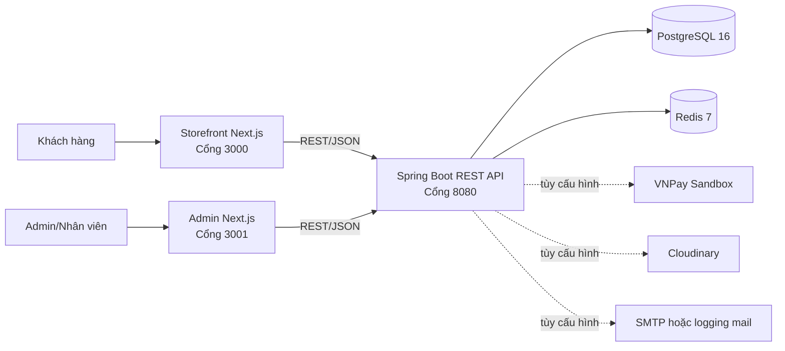

# HƯỚNG DẪN DÙNG CHATGPT VIẾT BÁO CÁO THỰC TẬP TỐT NGHIỆP

> Tài liệu này là bộ khung nội dung, nguồn sự thật và bộ prompt để dùng ChatGPT soạn báo cáo cho project `smart-sportswear-shop`. Tài liệu không phải bản báo cáo hoàn chỉnh và không thay thế việc kiểm tra của sinh viên, nhóm hoặc giảng viên hướng dẫn.

## 1. Mục đích và cách dùng nhanh

Tài liệu giải quyết ba vấn đề:

1. Giúp ChatGPT tuân thủ đúng quy cách báo cáo của Khoa Công nghệ thông tin 2, Học viện Công nghệ Bưu chính Viễn thông cơ sở Thành phố Hồ Chí Minh.
2. Cung cấp thông tin đúng với mã nguồn hiện tại, tránh dùng nhầm đặc tả cũ hoặc tự bịa chức năng.
3. Chia báo cáo thành các phần nhỏ để sinh nội dung, kiểm chứng, bổ sung hình và ghép thành bản Word/PDF 30–45 trang.

Cách dùng đề xuất:

1. Điền toàn bộ thông tin trong mục 7.
2. Chốt tên đề tài và phạm vi theo mục 6.
3. Gửi cho ChatGPT prompt nền ở mục 13.1.
4. Gửi lần lượt prompt từng phần ở mục 13.2–13.8; không yêu cầu sinh cả báo cáo trong một lần.
5. Sau mỗi phần, đối chiếu với mục 5, mục 8 và bản thân mã nguồn.
6. Chèn ảnh chụp, sơ đồ, kết quả kiểm thử thật vào Word.
7. Kiểm tra toàn bộ theo checklist ở mục 15 trước khi xuất PDF.

## 2. Thứ tự ưu tiên nguồn thông tin

Khi các nguồn mâu thuẫn nhau, phải dùng thứ tự ưu tiên sau:

1. Mã nguồn, migration, file cấu hình và test đang có trong project.
2. Kết quả chạy hệ thống, ảnh chụp giao diện và kết quả kiểm thử do nhóm thực hiện.
3. Hai văn bản quy định báo cáo do Khoa cung cấp.
4. Các file đặc tả trong repository như `PHASE1_SPEC.md`, `API_SPEC_PHASE1.md`, `ERD_PHASE1.md`.
5. Suy luận của ChatGPT chỉ được dùng khi ghi rõ đó là đề xuất, không phải chức năng đã triển khai.

Lưu ý quan trọng: `PHASE1_SPEC.md` có đoạn đề xuất backend NestJS và Prisma. Mã nguồn thực tế dùng Java 21, Spring Boot, Spring Data JPA và Flyway. Báo cáo phải mô tả công nghệ thực tế, không chép nguyên đặc tả cũ.

## 3. Quy định hình thức bắt buộc của báo cáo

Thông tin dưới đây được tổng hợp từ:

- `Van ban Huong dan nop quyen TTTN DHCQ nam 2026.docx`.
- `Phu luc_Hinh thuc va quy cach trinh bay quyen TTTN QD 922-210313.doc`.

### 3.1. Quy cách trang và chữ

| Hạng mục | Quy định |
|---|---|
| Khổ giấy | A4 |
| Lề trái | 3,0 cm |
| Lề trên, dưới, phải | 2,0 cm |
| Header, footer | 1,0 cm |
| Font nội dung | Times New Roman |
| Cỡ chữ nội dung | 12 hoặc 13, phải thống nhất |
| Canh đoạn | Justified, căn đều hai lề |
| Khoảng cách đoạn | Before 3 pt, After 3 pt |
| Giãn dòng | Multiple 1,1 đến 1,2 |
| Tiêu đề chương | IN HOA, đậm, cỡ 13–15 |
| Tiêu đề mục trong chương | Đậm, cỡ 13 |
| Độ dài nội dung | 30–45 trang |

Khuyến nghị dùng thống nhất Times New Roman 13 cho nội dung, cỡ 14–15 đậm cho tên chương, cỡ 13 đậm cho các mục. Nếu giảng viên hướng dẫn yêu cầu khác thì ưu tiên yêu cầu của giảng viên.

Không dùng font thư pháp, hoa văn trang trí, câu tục ngữ hoặc thành ngữ làm đề dẫn. Không trang trí đầu chương bằng hình không phục vụ nội dung khoa học.

### 3.2. Đánh số trang

- Dùng số La Mã thường `i, ii, iii, ...` từ Mục lục đến Kế hoạch thực hiện công việc nhóm.
- Dùng số Ả Rập `1, 2, 3, ...` từ Mở đầu đến Phụ lục.
- Văn bản phụ lục có một chỗ ghi “bắt đầu đánh số từ Chương 1”, nhưng phần hướng dẫn tổng quát ghi từ Mở đầu. Khi dàn trang nên hỏi giảng viên hướng dẫn nếu mẫu Word chính thức chưa thiết lập sẵn.

### 3.3. Header và footer

Mỗi trang nội dung phải có:

- Header trái: `Báo cáo TTTN Đại học`.
- Header phải: số chương và tên chương hiện tại.
- Footer trái: `Nhóm_<MÃ NHÓM>`, ví dụ `Nhóm_A01`.
- Footer phải: số trang.

### 3.4. Bảng, hình, sơ đồ và công thức

- Hình phải rõ và có tên hình ở phía dưới.
- Bảng, hình, sơ đồ được đánh số theo chương, ví dụ `Bảng 3.1`, `Hình 4.2`, `Sơ đồ 3.1`.
- Chữ số đầu là số chương, chữ số sau là thứ tự xuất hiện trong chương.
- Mỗi bảng, hình, sơ đồ phải có giải thích và nguồn. Với ảnh do nhóm chụp, ghi `Nguồn: Nhóm tác giả`.
- Công thức phải có số thứ tự sát lề phải.
- Không chèn ảnh rồi bỏ đó; nội dung phải dẫn chiếu và phân tích ảnh, ví dụ “Như thể hiện ở Hình 4.3...”.

### 3.5. Cấu trúc các phần theo quy định

Thứ tự khuyến nghị:

1. Bìa ngoài màu xanh nước biển, không dùng bìa kiếng.
2. Bìa đệm.
3. Phiếu giao đề cương thực tập tốt nghiệp đã được phê duyệt, bản chính có chữ ký tươi trong bản nộp.
4. Mục lục.
5. Lời cảm ơn.
6. Danh mục bảng.
7. Danh mục hình và sơ đồ.
8. Danh mục ký hiệu và chữ viết tắt.
9. Kế hoạch thực hiện công việc nhóm.
10. Mở đầu.
11. Các chương nội dung.
12. Kết luận và kiến nghị.
13. Phụ lục nếu có.
14. Danh mục tài liệu tham khảo.

Văn bản gốc liệt kê Lời cảm ơn trước các danh mục, còn phần mẫu có một số hướng dẫn xếp danh mục ngay sau Mục lục. Khi có template Word của Khoa hoặc yêu cầu riêng của giảng viên, giữ thứ tự trong template đó.

Văn bản cũng chưa hoàn toàn thống nhất vị trí Tài liệu tham khảo và Phụ lục: danh sách bố cục ban đầu đặt Tài liệu tham khảo trước Phụ lục, trong khi phần hướng dẫn cuối yêu cầu Tài liệu tham khảo nằm sau Phụ lục. Thứ tự ở trên chọn theo hướng dẫn cuối; sinh viên cần xác nhận lại với giảng viên hoặc mẫu Word chính thức trước khi đóng quyển.

### 3.6. Yêu cầu nộp báo cáo năm 2026

- Thời gian thực tập: 29/06/2026–08/08/2026.
- Báo cáo định kỳ lần 1: 13–14/07/2026, file `.doc`, tên dạng `GiaoVienHuongDan_MaNhom_BCDK1`.
- Báo cáo định kỳ lần 2: 27–28/07/2026, file `.doc`, tên dạng `GiaoVienHuongDan_MaNhom_BCDK2`.
- Báo cáo cuối kỳ nộp 01 quyển mỗi nhóm và toàn văn dạng PDF; không nộp code/chương trình vào thư mục báo cáo cuối kỳ.
- Bản nhận xét của đơn vị thực tập nộp riêng, không đóng trong cuốn báo cáo.
- Hệ đại trà nộp ngày 10–11/08/2026 tại Văn phòng Khoa CNTT2, phường TNP.
- Hệ chất lượng cao nộp chiều 11/08/2026 tại Văn phòng Khoa CNTT2, phường Sài Gòn.
- Văn bản năm 2026 ghi thời gian phản biện là `12/08/2025–17/08/2025`; đây có khả năng là lỗi năm. Phải xác nhận lại với Khoa hoặc giảng viên, không tự dùng mốc này làm thông tin chắc chắn.

## 4. Mô tả ngắn gọn và đúng về đề tài

Project là hệ thống thương mại điện tử thời trang/thể thao theo kiến trúc modular monolith. Hệ thống có ba lớp ứng dụng chính:

- Storefront dành cho khách hàng, xây dựng bằng Next.js và React.
- Trang quản trị dành cho nhân viên và quản trị viên, xây dựng bằng Next.js và React.
- REST API backend xây dựng bằng Java 21 và Spring Boot, kết nối PostgreSQL, Redis và các dịch vụ ngoài theo cấu hình.

Hệ thống hỗ trợ luồng thương mại điện tử từ tra cứu sản phẩm, giỏ hàng, kiểm tra đơn, đặt hàng, thanh toán, quản lý tồn kho đến vận hành đơn hàng. Backend được tổ chức theo module nghiệp vụ trong cùng một ứng dụng để giảm độ phức tạp triển khai nhưng vẫn giữ ranh giới giữa các miền chức năng.

### 4.1. Sơ đồ kiến trúc tổng quát dùng trong báo cáo



Khi đưa vào Word, nên vẽ lại bằng draw.io, Visio hoặc công cụ tương đương để bảo đảm hình rõ khi in.

## 5. Nguồn sự thật của project hiện tại

Các số liệu sau là snapshot ngày 14/07/2026 trên commit nền `482323c` cùng các thay đổi chưa commit đang có trong workspace. Trước khi nộp báo cáo phải đếm lại nếu project tiếp tục thay đổi.

| Hạng mục | Trạng thái/số lượng hiện tại | Nguồn kiểm chứng |
|---|---:|---|
| Backend Java | 416 file Java trong `src/main/java` | `backend/src/main/java` |
| Module nghiệp vụ backend | 25 module | `backend/src/main/java/.../modules` |
| REST controller | 42 | lớp có `@RestController` |
| Endpoint handler | 126 | các annotation mapping HTTP |
| Migration cơ sở dữ liệu | 13 migration | `backend/src/main/resources/db/migration` |
| Bảng được tạo bằng migration | 41 bảng | các lệnh `create table` |
| Route storefront | 18 trang `page.tsx` | `frontend/storefront/src/app` |
| Route admin | 20 trang `page.tsx` | `frontend/admin/src/app` |
| Test backend | 395 phương thức `@Test` trong 47 file có test | `backend/src/test/java` |

Không nên đưa số dòng code vào báo cáo vì số liệu này thay đổi nhanh và không phản ánh trực tiếp chất lượng.

### 5.1. Công nghệ thực tế

| Lớp | Công nghệ |
|---|---|
| Backend | Java 21, Spring Boot 3.5.15 |
| API | Spring Web MVC, REST/JSON, OpenAPI/Swagger |
| Bảo mật | Spring Security, JWT access/refresh token, BCrypt |
| Truy cập dữ liệu | Spring Data JPA/Hibernate |
| Database | PostgreSQL 16 |
| Migration | Flyway |
| Cache | Spring Cache, Redis và Caffeine theo cấu hình |
| Mapping | MapStruct |
| Validation | Jakarta Validation |
| Storefront | Next.js 16.2.1, React 19.2.4, TypeScript 5, Tailwind CSS 4 |
| Admin | Next.js 15.x, React 19.x, TypeScript, Recharts |
| Lưu ảnh | Cloudinary khi bật provider; có chế độ `none` |
| Email | SMTP khi bật provider; có chế độ logging cho local |
| Thanh toán | VNPay sandbox/demo |
| Đóng gói | Docker multi-stage, Docker Compose |
| Hạ tầng local | PostgreSQL, Redis, backend, storefront, admin |

Không ghi “microservices”. Project hiện là modular monolith và Docker Compose chỉ tách các tiến trình triển khai, không biến backend thành microservices.

### 5.2. Các vai trò người dùng

Backend định nghĩa bốn vai trò:

- `CUSTOMER`: khách hàng.
- `SALES_STAFF`: nhân viên bán hàng.
- `WAREHOUSE_STAFF`: nhân viên kho.
- `ADMIN`: quản trị viên.

Spring Security dùng phiên không trạng thái (`STATELESS`). Một số endpoint GET và endpoint xác thực là công khai; các endpoint còn lại yêu cầu xác thực. Quyền chi tiết còn được kiểm tra bằng `@PreAuthorize` tại controller/service.

### 5.3. Các module nghiệp vụ

25 module backend hiện có:

`address`, `audit`, `auth`, `banner`, `brand`, `cart`, `category`, `checkout`, `collection`, `coupon`, `inventory`, `notification`, `order`, `page`, `payment`, `product`, `promotion`, `replenishment`, `report`, `returns`, `review`, `setting`, `shipping`, `user`, `wishlist`.

Có thể gom thành các nhóm khi viết báo cáo:

| Nhóm | Module tiêu biểu | Nội dung |
|---|---|---|
| Tài khoản và bảo mật | auth, user, address | Đăng ký, đăng nhập, refresh/revoke token, quên mật khẩu, Google login, hồ sơ, địa chỉ, vai trò |
| Danh mục bán hàng | product, category, brand, collection | Sản phẩm, biến thể SKU/size/màu, ảnh, danh mục, thương hiệu, bộ sưu tập |
| Bán hàng | cart, wishlist, checkout, order | Giỏ hàng, yêu thích, kiểm tra giá/tồn/coupon, tạo và theo dõi đơn |
| Giá và tiếp thị | promotion, coupon, banner, page | Khuyến mãi, mã giảm giá, banner và nội dung trang |
| Thanh toán và giao vận | payment, shipping | VNPay demo, phương thức giao hàng, phí giao hàng, shipment/tracking |
| Vận hành | inventory, returns, review | Nhập/xuất/điều chỉnh kho, hoàn hàng/hoàn tiền, đánh giá sản phẩm |
| Quản trị hệ thống | report, notification, audit, setting | Báo cáo, thông báo, mẫu thông báo, nhật ký, cấu hình |
| Nền tảng bổ sung hàng | replenishment | Chính sách tồn, lịch sử nhu cầu, cấu trúc forecast/recommendation; chưa hoàn thiện luồng dự báo end-to-end |

### 5.4. Cơ sở dữ liệu

Các migration tạo 41 bảng. Khi viết chương thiết kế, không cần mô tả cả 41 bảng với mức độ ngang nhau. Nên trình bày ERD tổng quát rồi phân tích các cụm chính:

- Người dùng: `users`, `refresh_tokens`, `password_reset_tokens`, `addresses`.
- Catalog: `categories`, `brands`, `products`, `product_variants`, `product_images`, `collections`, `product_collections`.
- Bán hàng: `carts`, `cart_items`, `orders`, `order_items`, `payments`.
- Khuyến mãi: `promotions`, `promotion_rules`, `promotion_products`, `coupons`, `coupon_usages`.
- Kho và vận chuyển: `inventory_transactions`, `shipping_methods`, `shipments`.
- Hậu mãi: `returns`, `return_items`, `refunds`, `product_reviews`, `wishlists`, `wishlist_items`.
- Nội dung/vận hành: `banners`, `banner_items`, `pages`, `site_settings`, `audit_logs`, `email_logs`, `notifications`, `notification_templates`.
- Bổ sung hàng: `inventory_policies`, `forecast_runs`, `replenishment_recommendations`.

Các trạng thái quan trọng:

- Đơn hàng: `PENDING_CONFIRMATION`, `CONFIRMED`, `PACKING`, `SHIPPING`, `DELIVERED`, `CANCELLED`.
- Thanh toán: `UNPAID`, `PENDING`, `PAID`, `FAILED`, `CANCELLED`, `REFUNDED`.
- Vai trò: `CUSTOMER`, `SALES_STAFF`, `WAREHOUSE_STAFF`, `ADMIN`.

Không đồng nhất trạng thái đơn hàng và trạng thái thanh toán; đây là hai state machine riêng.

### 5.5. Luồng nghiệp vụ cốt lõi cần trình bày

#### Luồng đặt hàng

1. Người dùng chọn biến thể sản phẩm và thêm vào giỏ.
2. Hệ thống kiểm tra sản phẩm/biến thể còn hoạt động, số lượng hợp lệ, giá và tồn khả dụng.
3. Checkout preview tính tạm tính, phí giao hàng, coupon/khuyến mãi và tổng tiền.
4. Khi tạo đơn, backend khóa/kiểm tra biến thể để giảm rủi ro bán vượt tồn.
5. Tồn kho được ghi nhận theo các loại giao dịch reserve, deduct, release hoặc các thao tác kho.
6. Đơn hàng đi qua các chuyển trạng thái được cho phép.
7. Với thanh toán trực tuyến, hệ thống tạo payment session/URL VNPay và xử lý callback có xác minh chữ ký.
8. Trạng thái thanh toán và trạng thái đơn được cập nhật theo quy tắc nghiệp vụ.

#### Luồng quản lý tồn kho

- Theo dõi `stockQuantity` và `reservedQuantity` ở biến thể.
- Tính tồn khả dụng từ tồn vật lý trừ phần đã giữ.
- Hỗ trợ nhập kho, xuất kho, điều chỉnh kho và lưu lịch sử giao dịch.
- Khi tạo/hủy/xử lý đơn, hệ thống reserve, deduct hoặc release tương ứng.

#### Luồng xác thực

- Đăng ký/đăng nhập cấp access token và refresh token.
- Refresh token có lưu trữ và cơ chế revoke.
- Quên mật khẩu dùng token có thời hạn và email/logging provider.
- Google login có hỗ trợ backend theo cấu hình.
- Phân quyền dựa trên vai trò và Spring Security.

### 5.6. Báo cáo quản trị

Backend có API tổng quan, báo cáo đơn, sản phẩm bán chạy và tồn kho. Cần mô tả đúng quy ước:

- Gross revenue: tổng tiền các đơn có `paymentStatus = PAID`.
- Realized revenue: tổng tiền các đơn có `orderStatus = DELIVERED`.
- Hai chỉ số phục vụ hai góc nhìn khác nhau, không mặc định phải bằng nhau.
- Báo cáo tồn gồm tổng biến thể, tổng tồn, tổng giữ chỗ, tồn khả dụng và danh sách tồn thấp.

### 5.7. Trạng thái thật của chức năng dự báo/bổ sung hàng

Phần `replenishment` hiện có:

- Migration cho chính sách tồn, lần chạy dự báo và khuyến nghị bổ sung.
- Entity, repository và enum liên quan.
- Truy vấn tổng hợp nhu cầu theo ngày từ các đơn ở trạng thái hợp lệ.
- Bổ sung ngày không có giao dịch bằng giá trị 0.
- Seeder dữ liệu demo lịch sử bán có random seed để tái lập.
- Enum dự kiến cho `MOVING_AVERAGE`, `EWMA`, `CROSTON`.

Phần chưa thấy hoàn chỉnh trong mã nguồn hiện tại:

- Service thực thi và so sánh đầy đủ ba thuật toán.
- Pipeline tạo forecast run và replenishment recommendation end-to-end.
- Scheduler chạy dự báo tự động.
- REST controller/API quản trị dự báo.
- Giao diện admin xem/duyệt khuyến nghị nhập hàng.
- Bộ test hoàn chỉnh cho thuật toán và API dự báo.

Vì vậy báo cáo chỉ được gọi đây là “nền tảng dữ liệu/thiết kế đang phát triển” hoặc “hướng mở rộng”, trừ khi các phần trên được bổ sung và kiểm thử trước khi chốt báo cáo.

### 5.8. Các giới hạn khác phải mô tả trung thực

- Mục Chatbot ở admin hiện là route giữ chỗ; không được ghi chatbot đã hoàn thành.
- Admin có nhánh dùng mock/fallback khi không cấu hình API base URL. Khi demo thật phải cấu hình backend và chứng minh dữ liệu đến từ API.
- Cloudinary và SMTP phụ thuộc provider/cấu hình; chế độ local có thể không upload/gửi thật.
- VNPay dùng môi trường sandbox/demo, không phải thanh toán production.
- Storefront có một số nội dung marketing/editorial và dữ liệu cửa hàng tĩnh; không nên khẳng định tất cả đều quản trị động từ database.
- Chỉ ghi deploy production nếu có URL, môi trường và bằng chứng triển khai thật. Docker Compose local không đồng nghĩa đã deploy production.

## 6. Chọn tên đề tài và phạm vi báo cáo

### 6.1. Tên an toàn, phù hợp trạng thái hiện tại

Khuyến nghị:

> XÂY DỰNG HỆ THỐNG THƯƠNG MẠI ĐIỆN TỬ KINH DOANH THỜI TRANG THỂ THAO

Hoặc:

> XÂY DỰNG WEBSITE BÁN HÀNG THỜI TRANG THỂ THAO VÀ HỆ THỐNG QUẢN TRỊ VẬN HÀNH

### 6.2. Nếu muốn nhấn mạnh tồn kho

> XÂY DỰNG HỆ THỐNG THƯƠNG MẠI ĐIỆN TỬ THỜI TRANG THỂ THAO TÍCH HỢP QUẢN LÝ TỒN KHO

### 6.3. Không nên dùng ở trạng thái hiện tại

Không nên đặt tên “hệ thống AI dự báo nhu cầu và tự động đề xuất nhập hàng” vì luồng AI/dự báo end-to-end chưa hoàn thiện. Chỉ dùng tên đó sau khi đã có thuật toán, API, UI, kết quả đánh giá và test thực tế.

## 7. Thông tin bắt buộc sinh viên phải điền

Không cho ChatGPT tự bịa các trường sau:

```text
Tên đề tài chính thức: [CHƯA ĐIỀN]
Giảng viên hướng dẫn: [CHƯA ĐIỀN]
Mã nhóm: [CHƯA ĐIỀN]
Sinh viên 1 - MSSV - lớp: [CHƯA ĐIỀN]
Sinh viên 2 - MSSV - lớp: [NẾU CÓ]
Ngành/chuyên ngành: [CHƯA ĐIỀN]
Đơn vị thực tập: [CHƯA ĐIỀN]
Người hướng dẫn tại đơn vị: [CHƯA ĐIỀN]
Vị trí thực tập: [CHƯA ĐIỀN]
Thời gian thực tập: 29/06/2026–08/08/2026
Nhiệm vụ được giao theo phiếu đề cương: [CHƯA ĐIỀN]
Phân công từng thành viên: [CHƯA ĐIỀN]
Môi trường demo/deploy và URL: [CHƯA ĐIỀN]
Kết quả test thực chạy cuối cùng: [CHƯA ĐIỀN]
Khó khăn thực tế và cách xử lý: [CHƯA ĐIỀN]
Tài liệu tham khảo thật đã đọc: [CHƯA ĐIỀN]
```

Nếu chưa có thông tin, ChatGPT phải giữ `[CẦN BỔ SUNG: ...]`, không điền tên hoặc số liệu giả.

## 8. Đề cương báo cáo đề xuất 30–45 trang

Số trang dưới đây chỉ tính phần từ Mở đầu đến Kết luận, chưa tính bìa, mục lục, danh mục, kế hoạch, phụ lục và tài liệu tham khảo.

| Phần | Số trang gợi ý |
|---|---:|
| Mở đầu | 2–3 |
| Chương 1. Tổng quan đề tài và yêu cầu | 4–5 |
| Chương 2. Cơ sở lý thuyết và công nghệ | 5–6 |
| Chương 3. Phân tích và thiết kế hệ thống | 8–10 |
| Chương 4. Xây dựng và triển khai hệ thống | 9–11 |
| Chương 5. Kiểm thử và đánh giá | 4–5 |
| Kết luận và kiến nghị | 2 |
| Tổng | 34–42 |

### MỞ ĐẦU

Viết ngắn gọn, trả lời đủ:

- Lý do chọn đề tài: nhu cầu mua sắm trực tuyến, quản lý catalog theo biến thể, tồn kho và vận hành đơn.
- Mục tiêu: xây dựng hệ thống end-to-end có storefront, admin và backend API.
- Đối tượng sử dụng: khách hàng, nhân viên bán hàng, nhân viên kho và admin.
- Phạm vi: các chức năng đã triển khai; nêu rõ VNPay sandbox và các provider tùy cấu hình.
- Phương pháp: khảo sát yêu cầu, phân tích nghiệp vụ, thiết kế kiến trúc/database/API, lập trình, kiểm thử.
- Kết cấu báo cáo: tóm tắt từng chương bằng 1–2 câu.

Không viết dài về lịch sử thương mại điện tử. Không tuyên bố có AI hoàn chỉnh.

### CHƯƠNG 1. TỔNG QUAN ĐỀ TÀI VÀ YÊU CẦU HỆ THỐNG

#### 1.1. Giới thiệu đơn vị thực tập

Chỉ viết từ thông tin xác thực do sinh viên cung cấp:

- Tên, lĩnh vực, cơ cấu hoặc bộ phận thực tập.
- Vai trò của nhóm/sinh viên.
- Quy trình làm việc và người hướng dẫn.

Nếu đây là project học tập không thuộc sản phẩm của doanh nghiệp, phải nói đúng bản chất.

#### 1.2. Bài toán thực tế

Phân tích các vấn đề:

- Sản phẩm thời trang có nhiều biến thể size/màu/SKU.
- Cần đồng bộ giá, tồn khả dụng và giỏ hàng.
- Đơn hàng có vòng đời nhiều trạng thái.
- Thanh toán và đơn hàng là hai luồng trạng thái khác nhau.
- Admin cần quản lý tập trung catalog, kho, đơn, hậu mãi và báo cáo.

#### 1.3. Mục tiêu

Nên chia thành:

- Mục tiêu tổng quát.
- Mục tiêu chức năng.
- Mục tiêu kỹ thuật: bảo mật, toàn vẹn giao dịch, phân quyền, khả năng chạy local bằng Docker.

#### 1.4. Phạm vi và giới hạn

Lập bảng `Trong phạm vi / Ngoài phạm vi / Đang phát triển`. Đưa chatbot và dự báo end-to-end vào ngoài phạm vi hoặc đang phát triển.

#### 1.5. Yêu cầu chức năng

Chia theo actor:

- Customer: auth, duyệt/tìm/lọc, chi tiết sản phẩm, giỏ, checkout, đơn, wishlist, địa chỉ, review/return nếu giao diện và API đã xác minh.
- Sales staff: vận hành đơn và giao hàng theo quyền thực tế.
- Warehouse staff: nhập, xuất, điều chỉnh và xem giao dịch kho.
- Admin: quản trị các module và báo cáo.

#### 1.6. Yêu cầu phi chức năng

Chỉ nêu yêu cầu có liên quan đến thiết kế:

- Bảo mật: JWT, BCrypt, RBAC, validation, CORS.
- Tính nhất quán: transaction, khóa bản ghi biến thể khi xử lý đơn/tồn.
- Hiệu năng: phân trang, index migration V12, cache báo cáo.
- Khả năng bảo trì: modular monolith, DTO/service/repository.
- Khả năng triển khai: Docker multi-stage và Docker Compose.

### CHƯƠNG 2. CƠ SỞ LÝ THUYẾT VÀ CÔNG NGHỆ

#### 2.1. Kiến trúc modular monolith

Giải thích khái niệm, ưu/nhược điểm và lý do chọn. Liên hệ trực tiếp với 25 module nghiệp vụ trong project. Không mô tả backend là microservices.

#### 2.2. REST API và mô hình phân lớp

Trình bày luồng `Controller -> Service -> Repository -> PostgreSQL`, DTO request/response và validation.

#### 2.3. Java, Spring Boot, Spring Security, JPA và Flyway

Mỗi công nghệ nên có:

- Vai trò trong project.
- Lý do chọn.
- Vị trí ứng dụng cụ thể trong mã nguồn.

Tránh viết kiểu quảng cáo chung chung hoặc liệt kê lịch sử phiên bản.

#### 2.4. Next.js, React và TypeScript

Phân biệt storefront và admin. Nêu App Router, server/client component ở mức project thực sự sử dụng, module API client và xử lý biến môi trường.

#### 2.5. PostgreSQL, Redis và cache

Giải thích dữ liệu quan hệ, transaction, migration. Chỉ nói Redis/Caffeine theo cấu hình đang có; không phóng đại benchmark nếu chưa đo.

#### 2.6. Docker và tích hợp ngoài

Trình bày Docker multi-stage, Compose và năm service: PostgreSQL, Redis, backend, storefront, admin. Cloudinary, SMTP và VNPay phải ghi là tích hợp tùy cấu hình/sandbox.

### CHƯƠNG 3. PHÂN TÍCH VÀ THIẾT KẾ HỆ THỐNG

#### 3.1. Tác nhân và use case tổng quát

Vẽ use case cho bốn vai trò. Không nhồi toàn bộ chức năng vào một hình; có thể tách customer và back-office.

#### 3.2. Kiến trúc hệ thống

Dùng sơ đồ mục 4.1 và phân tích:

- Client nào phục vụ actor nào.
- Giao tiếp REST/JSON.
- Backend giữ business rule.
- PostgreSQL là nguồn dữ liệu chính.
- Redis/cache và dịch vụ ngoài.

#### 3.3. Thiết kế module

Dùng bảng nhóm module ở mục 5.3. Chọn 5–7 module cốt lõi để phân tích sâu; các module còn lại chỉ mô tả vai trò.

#### 3.4. Thiết kế cơ sở dữ liệu

Nên có:

- ERD tổng quát.
- ERD chi tiết cho catalog.
- ERD chi tiết cho order/payment/inventory.
- Giải thích khóa chính UUID, khóa ngoại, unique SKU/slug và các trạng thái.

ERD phải được tạo lại từ migration/entity hiện tại. Không dùng nguyên `ERD_PHASE1.md` nếu chưa đối chiếu V2–V13.

#### 3.5. Thiết kế API

Không cần liệt kê 126 endpoint trong thân báo cáo. Chọn nhóm tiêu biểu:

- `/api/v1/auth/*`.
- `/api/v1/products`, `/api/v1/categories`, `/api/v1/brands`.
- `/api/v1/cart`, `/api/v1/checkout/*`, `/api/v1/orders`.
- `/api/v1/payments/*`.
- `/api/v1/admin/inventory/*`, `/api/v1/admin/orders/*`.
- `/api/v1/admin/reports/*`.

Danh sách đầy đủ có thể đưa vào phụ lục hoặc dẫn Swagger.

#### 3.6. Thiết kế bảo mật

Vẽ sequence login/refresh token. Phân tích:

- Password hash.
- JWT access/refresh.
- Stateless session.
- Endpoint public/protected.
- RBAC với `@PreAuthorize`.
- Validation và xử lý lỗi thống nhất.

Không công bố JWT secret, password seed, API key hoặc `.env`.

#### 3.7. Sequence diagram nghiệp vụ

Tối thiểu nên có:

1. Đăng nhập.
2. Thêm vào giỏ và checkout preview.
3. Tạo đơn và reserve tồn.
4. Thanh toán VNPay callback.
5. Admin chuyển trạng thái đơn và cập nhật tồn/giao hàng.

### CHƯƠNG 4. XÂY DỰNG VÀ TRIỂN KHAI HỆ THỐNG

#### 4.1. Tổ chức mã nguồn

Mô tả ba thư mục `backend`, `frontend/storefront`, `frontend/admin`. Với backend, lấy một module tiêu biểu để minh họa cấu trúc `controller/dto/entity/mapper/repository/service`.

#### 4.2. Xây dựng storefront

Chèn ảnh thật và phân tích các trang:

- Trang chủ.
- Danh mục/tìm kiếm/lọc.
- Chi tiết sản phẩm và chọn biến thể.
- Giỏ hàng.
- Checkout.
- Đăng nhập/tài khoản/đơn hàng/yêu thích.

Không chèn quá nhiều ảnh gần giống nhau. Mỗi ảnh phải cho thấy một chức năng hoặc quyết định thiết kế.

#### 4.3. Xây dựng trang quản trị

Chọn các màn hình giá trị nhất:

- Dashboard/báo cáo.
- Quản lý sản phẩm, biến thể và ảnh.
- Quản lý đơn hàng.
- Quản lý tồn kho.
- Khuyến mãi/coupon.
- Đổi trả/đánh giá/người dùng/audit nếu có ảnh và dữ liệu demo.

Không dùng trang Chatbot giữ chỗ làm kết quả hoàn thành.

#### 4.4. Xây dựng backend và business rule

Phân tích sâu ba luồng:

- Auth và phân quyền.
- Order-checkout-payment.
- Inventory reserve/deduct/release.

Chỉ trích đoạn code ngắn, có mục đích. Ưu tiên pseudocode, sequence diagram và giải thích business rule hơn việc dán nhiều trang code.

#### 4.5. Migration, seed và dữ liệu demo

Trình bày Flyway V1–V13 theo nhóm thay đổi, không cần chép SQL. Nêu seed chỉ chạy khi bật cấu hình. Phần forecast demo dùng random seed 2026 và số ngày/số đơn có thể cấu hình; không gọi dữ liệu demo là dữ liệu kinh doanh thật.

#### 4.6. Đóng gói và chạy hệ thống

Mô tả:

- Backend build JAR bằng Maven rồi chạy trên JRE Java 21.
- Storefront/admin dùng Docker multi-stage.
- Compose nối các service và health check PostgreSQL/Redis.
- Cổng local: storefront 3000, admin 3001, backend 8080; PostgreSQL host mặc định đang map 5434.

Không đưa toàn bộ secret hoặc file `.env` vào báo cáo.

#### 4.7. Phần nền tảng dự báo nếu cần

Chỉ mô tả ở mức đã triển khai:

- Cách tổng hợp nhu cầu theo ngày từ order item.
- Chỉ lấy các trạng thái đơn hợp lệ.
- Chèn ngày không bán bằng 0 để tránh tăng sai nhu cầu trung bình.
- Schema chính sách tồn, forecast run và recommendation.
- Kế hoạch Moving Average/EWMA/Croston là hướng phát triển nếu chưa có implementation.

### CHƯƠNG 5. KIỂM THỬ VÀ ĐÁNH GIÁ

#### 5.1. Chiến lược kiểm thử

Phân biệt:

- Unit test cho service/utility.
- Integration test cho API, security, repository và business flow.
- Kiểm thử thủ công giao diện.
- Build/lint/typecheck frontend.

#### 5.2. Môi trường kiểm thử

Điền máy, hệ điều hành, Java, Node, Docker, database và ngày chạy thật. Không để ChatGPT tự tạo cấu hình máy.

#### 5.3. Test case tiêu biểu

Lập bảng gồm: mã test, chức năng, dữ liệu đầu vào, bước thực hiện, kết quả mong đợi, kết quả thực tế, trạng thái.

Tối thiểu nên có:

- Đăng ký trùng email.
- Đăng nhập đúng/sai, refresh/revoke token.
- Truy cập endpoint sai quyền.
- Tìm kiếm/lọc/phân trang sản phẩm.
- Thêm giỏ vượt tồn.
- Checkout với coupon hợp lệ/không hợp lệ.
- Hai yêu cầu đặt hàng cạnh tranh trên cùng biến thể.
- Chuyển trạng thái đơn hợp lệ/không hợp lệ.
- Hủy đơn và release tồn.
- Callback VNPay đúng/sai chữ ký và tính idempotent.
- Nhập/xuất/điều chỉnh kho.
- Review chỉ từ order item hợp lệ.
- Return/refund theo trạng thái.

#### 5.4. Kết quả kiểm thử

Snapshot mã nguồn có 395 phương thức `@Test`, nhưng số này không được dùng thay cho kết quả chạy. Trước khi viết phải chạy test và ghi:

```text
Ngày chạy: [CẦN BỔ SUNG]
Lệnh chạy: [CẦN BỔ SUNG]
Tổng test phát hiện: [CẦN BỔ SUNG]
Passed: [CẦN BỔ SUNG]
Failed: [CẦN BỔ SUNG]
Skipped: [CẦN BỔ SUNG]
Kết quả build storefront: [CẦN BỔ SUNG]
Kết quả build admin: [CẦN BỔ SUNG]
```

Chèn ảnh terminal hoặc báo cáo test thật. Không ghi “100% test passed” chỉ vì thấy nhiều file test.

#### 5.5. Đánh giá

Chia thành:

- Kết quả đạt được.
- Hạn chế.
- Nguyên nhân.
- Hướng cải tiến.

Không dùng phần hạn chế như lời xin lỗi. Viết theo góc nhìn kỹ thuật và có phương án cụ thể.

### KẾT LUẬN VÀ KIẾN NGHỊ

Tóm tắt mục tiêu đã đạt theo bằng chứng. Nêu bài học về phân tích nghiệp vụ, transaction tồn kho, bảo mật, frontend/backend integration, migration và kiểm thử.

Hướng phát triển hợp lý:

- Hoàn thiện pipeline dự báo và khuyến nghị bổ sung hàng.
- Đánh giá Moving Average, EWMA và Croston bằng MAE/WAPE trên dữ liệu đủ dài.
- Hoàn thiện trang admin cho dự báo.
- Triển khai production với quản lý secret, HTTPS, monitoring, backup.
- Bổ sung E2E test trình duyệt và kiểm thử tải.
- Hoàn thiện chatbot chỉ khi có yêu cầu, dữ liệu và kiểm thử phù hợp.

## 9. Danh sách hình và bảng nên chuẩn bị

### 9.1. Hình/sơ đồ

| Mã gợi ý | Nội dung | Nguồn |
|---|---|---|
| Hình 3.1 | Use case customer | Nhóm tác giả |
| Hình 3.2 | Use case back-office | Nhóm tác giả |
| Hình 3.3 | Kiến trúc tổng quát | Nhóm tác giả, dựng từ mã nguồn |
| Hình 3.4 | ERD catalog | Nhóm tác giả, dựng từ migration |
| Hình 3.5 | ERD order-payment-inventory | Nhóm tác giả, dựng từ migration |
| Hình 3.6 | Sequence đăng nhập/refresh | Nhóm tác giả |
| Hình 3.7 | Sequence checkout và tạo đơn | Nhóm tác giả |
| Hình 3.8 | Sequence thanh toán VNPay | Nhóm tác giả |
| Hình 4.1 | Cấu trúc source code | Ảnh/chế bản của nhóm |
| Hình 4.2–4.x | Các giao diện storefront | Ảnh chụp hệ thống |
| Hình 4.x | Các giao diện admin | Ảnh chụp hệ thống |
| Hình 4.x | Swagger/API hoặc Compose | Ảnh chụp hệ thống |
| Hình 5.1 | Kết quả test backend | Ảnh chụp terminal/report |
| Hình 5.2 | Kết quả build frontend | Ảnh chụp terminal |

### 9.2. Bảng

- Bảng tác nhân và quyền.
- Bảng yêu cầu chức năng.
- Bảng yêu cầu phi chức năng.
- Bảng so sánh/lý do chọn công nghệ.
- Bảng nhóm module.
- Bảng mô tả các bảng dữ liệu cốt lõi.
- Bảng endpoint tiêu biểu.
- Bảng quy tắc chuyển trạng thái đơn.
- Bảng test case và kết quả.
- Bảng đối chiếu mục tiêu với kết quả.
- Bảng hạn chế và hướng phát triển.

## 10. File nên cung cấp cho ChatGPT theo từng chương

Không cần tải toàn bộ repository lên một lượt. Chỉ cung cấp file cần thiết:

| Nội dung | File/thư mục ưu tiên |
|---|---|
| Stack và dependency backend | `backend/pom.xml` |
| Cấu hình | `backend/src/main/resources/application.yml` sau khi xóa/che secret |
| Hạ tầng | `docker-compose.yml`, ba `Dockerfile` |
| Database | `backend/src/main/resources/db/migration/*.sql` |
| Security | `SecurityConfig.java`, package `common/security`, module `auth` |
| Sản phẩm | module `product`, `category`, `brand`, `collection` |
| Checkout/order | module `cart`, `checkout`, `order`, `coupon`, `promotion` |
| Payment | module `payment`, `AppVnpayProperties.java` |
| Inventory | module `inventory`, entity `ProductVariant` |
| Admin report | module `report` |
| Dự báo/bổ sung | module `replenishment`, migration V13, seeder forecast |
| Storefront | `frontend/storefront/src/app`, `src/modules`, `src/lib/endpoints.ts` |
| Admin | `frontend/admin/src/app`, `src/components`, `src/modules/api/endpoints.ts` |
| Test | `backend/src/test/java` và output chạy test thật |

Không upload `.env`, secret, password thật, API key, JWT secret, private key hoặc dữ liệu cá nhân của khách hàng.

## 11. Quy tắc viết để báo cáo không giống nội dung AI bịa

ChatGPT phải tuân thủ:

1. Mỗi nhận định kỹ thuật phải truy được về file, ảnh, output test hoặc tài liệu tham khảo.
2. Không tự tạo tên công ty, người hướng dẫn, số liệu doanh thu, số khách hàng, benchmark hoặc kết quả test.
3. Không dùng từ “AI” nếu đoạn đang mô tả thống kê/quy tắc thông thường.
4. Không gọi seed data là dữ liệu thực tế.
5. Không gọi sandbox là production.
6. Không gọi Docker Compose là microservices.
7. Không gọi enum thuật toán là thuật toán đã hoạt động.
8. Không chép dài tài liệu công nghệ; phải liên hệ với project.
9. Không dán quá nhiều code; mỗi đoạn code phải được giải thích.
10. Không tạo tài liệu tham khảo không tồn tại, DOI giả hoặc URL giả.
11. Với thông tin thiếu, ghi `[CẦN BỔ SUNG: ...]`.
12. Viết giọng văn học thuật tiếng Việt, câu rõ, hạn chế tính từ quảng cáo như “tối ưu”, “mạnh mẽ”, “hoàn hảo” nếu không có số đo.

## 12. Cách trích dẫn tài liệu tham khảo

Danh mục phải chứa tài liệu nhóm thực sự đọc. Ưu tiên tài liệu chính thức:

- Spring Boot, Spring Security, Spring Data JPA, Flyway.
- PostgreSQL, Redis, Docker.
- Next.js, React, TypeScript.
- VNPay sandbox/API nếu có tài liệu được sử dụng.
- Sách/bài báo về thương mại điện tử, quản lý tồn kho hoặc dự báo nếu thực sự tham khảo.

Khi dùng ChatGPT để tìm tài liệu, yêu cầu nó cung cấp link chính thức rồi sinh viên phải mở và kiểm tra. Không chấp nhận citation chỉ vì tiêu đề nghe hợp lý.

Văn bản Khoa yêu cầu sắp xếp tài liệu tham khảo theo ABC và ghi đủ tác giả, tên tài liệu, nơi/năm. Có thể chia Tiếng Việt, Tiếng Anh và Website nếu template yêu cầu.

## 13. Bộ prompt dùng trực tiếp với ChatGPT

### 13.1. Prompt nền cho toàn bộ phiên làm việc

```text
Bạn là trợ lý biên soạn báo cáo thực tập tốt nghiệp ngành Công nghệ thông tin bằng tiếng Việt. Hãy viết theo văn phong học thuật, rõ ràng, có phân tích và không quảng cáo.

Nguồn sự thật theo thứ tự ưu tiên: (1) mã nguồn/file tôi cung cấp; (2) output chạy và ảnh hệ thống; (3) quy định của Khoa; (4) đặc tả; (5) suy luận phải ghi rõ là đề xuất.

Quy tắc tuyệt đối:
- Không tự bịa tên, số liệu, kết quả test, tài liệu tham khảo hoặc chức năng.
- Nếu thiếu thông tin, giữ nhãn [CẦN BỔ SUNG: nội dung cần điền].
- Không mô tả project là microservices; backend là modular monolith Spring Boot.
- Không mô tả NestJS/Prisma vì đó là đề xuất cũ, không phải implementation hiện tại.
- Không tuyên bố AI dự báo đã hoàn chỉnh. Hiện module replenishment mới có schema/entity/repository, tổng hợp daily demand và seed demo; chưa có pipeline thuật toán/API/UI hoàn chỉnh.
- Không mô tả chatbot đã hoàn thành.
- VNPay là sandbox/demo; Cloudinary và SMTP phụ thuộc cấu hình.
- Khi nêu một chi tiết kỹ thuật, cuối đoạn hãy thêm dòng “Căn cứ mã nguồn:” và liệt kê file liên quan để tôi kiểm tra; dòng này dùng trong bản nháp và sẽ bỏ khi dàn trang cuối.
- Không tạo citation giả. Chỉ sử dụng tài liệu tham khảo tôi đã xác nhận.

Trước khi viết mỗi phần, hãy trả về:
1. Danh sách thông tin đã đủ.
2. Danh sách thông tin còn thiếu.
3. Dàn ý chi tiết.
Chỉ viết nội dung sau khi tôi xác nhận dàn ý.
```

### 13.2. Prompt lập đề cương hoàn chỉnh

```text
Dựa trên file HUONG_DAN_CHATGPT_VIET_BAO_CAO_TTTN.md và các file project đã cung cấp, hãy lập đề cương báo cáo 30–45 trang.

Yêu cầu đầu ra:
- Cấu trúc từ Mở đầu, Chương 1 đến Chương 5, Kết luận, Phụ lục và Tài liệu tham khảo.
- Đánh số mục tối đa đến cấp 3, ví dụ 3.2.1.
- Ghi số trang dự kiến cho từng mục.
- Ghi bảng/hình/sơ đồ cần chèn ở từng mục.
- Ghi file mã nguồn làm bằng chứng cho từng mục kỹ thuật.
- Đánh dấu thông tin còn thiếu bằng [CẦN BỔ SUNG].
- Tổng phần nội dung phải nằm trong 34–42 trang để có vùng an toàn.
Chưa viết thành đoạn văn ở bước này.
```

### 13.3. Prompt viết Mở đầu và Chương 1

```text
Hãy soạn bản nháp Mở đầu và Chương 1 theo đề cương đã duyệt.

Mở đầu phải có: lý do chọn đề tài, mục tiêu, đối tượng, phạm vi, phương pháp và kết cấu báo cáo.
Chương 1 phải có: đơn vị thực tập (chỉ dùng dữ liệu tôi cung cấp), bài toán, mục tiêu, actor, yêu cầu chức năng, yêu cầu phi chức năng, phạm vi và giới hạn.

Không viết lịch sử thương mại điện tử dài dòng. Không tuyên bố AI/chatbot hoàn chỉnh. Dùng bảng cho actor, yêu cầu và phạm vi. Sau mỗi mục kỹ thuật ghi file căn cứ trong bản nháp.
Độ dài mục tiêu: 6–8 trang Word theo quy cách Times New Roman 13, giãn dòng 1,15.
```

### 13.4. Prompt viết Chương 2

```text
Hãy viết Chương 2 “Cơ sở lý thuyết và công nghệ” dựa trên dependency/config thực tế.

Phân tích modular monolith, REST, Java 21, Spring Boot, Spring Security/JWT, JPA, Flyway, PostgreSQL, Redis/cache, Next.js/React/TypeScript, Docker Compose và tích hợp ngoài.

Với mỗi công nghệ phải trả lời: công nghệ giải quyết vấn đề gì, project dùng ở đâu, lý do phù hợp và giới hạn. Không chép nội dung marketing. Không dùng version nếu chưa kiểm chứng từ pom/package/compose. Đề xuất 1 bảng tổng hợp công nghệ và 1 sơ đồ mô hình phân lớp.
Độ dài mục tiêu: 5–6 trang.
```

### 13.5. Prompt viết Chương 3

```text
Hãy viết Chương 3 “Phân tích và thiết kế hệ thống” từ controller, entity, migration, security config và service tôi cung cấp.

Phải có: actor/use case, kiến trúc, nhóm module, ERD, thiết kế API, bảo mật, sequence login, checkout, tạo đơn, VNPay callback và quản lý tồn.

Không liệt kê toàn bộ 126 endpoint trong thân chương. Chọn endpoint tiêu biểu, phần đầy đủ chuyển sang phụ lục. Không suy ra quan hệ database chỉ từ tên; ưu tiên migration/entity. Phân biệt OrderStatus và PaymentStatus. Mỗi sơ đồ phải kèm mô tả đầu vào, bước xử lý và kết quả.
Độ dài mục tiêu: 8–10 trang.
```

### 13.6. Prompt viết Chương 4

```text
Hãy viết Chương 4 “Xây dựng và triển khai hệ thống” dựa trên mã nguồn và danh sách ảnh tôi cung cấp.

Trình bày tổ chức source, storefront, admin, backend business rule, migration/seed, Docker và ba luồng cốt lõi: auth, order-payment, inventory.

Khi cần hình, chèn placeholder theo mẫu:
[CHÈN HÌNH 4.x: mô tả ảnh cần chụp]
Đoạn sau placeholder phải phân tích hình, không chỉ nói giao diện đẹp.

Phần replenishment chỉ mô tả daily demand, schema và seed demo là nền tảng đang phát triển. Không gọi enum MOVING_AVERAGE/EWMA/CROSTON là implementation hoàn chỉnh.
Độ dài mục tiêu: 9–11 trang.
```

### 13.7. Prompt viết Chương 5

```text
Hãy viết Chương 5 “Kiểm thử và đánh giá” chỉ từ test source và output chạy thật tôi cung cấp.

Phân loại unit/integration/manual/build test. Tạo bảng test case tiêu biểu gồm ID, mục tiêu, tiền điều kiện, bước, expected, actual, status. Nếu chưa có output, để [CẦN BỔ SUNG], tuyệt đối không ghi pass.

Phân tích điểm mạnh, hạn chế và nguyên nhân. Nêu số phương thức @Test trong snapshot mã nguồn chỉ như chỉ báo quy mô, không thay thế kết quả chạy test.
Độ dài mục tiêu: 4–5 trang.
```

### 13.8. Prompt viết Kết luận

```text
Hãy viết Kết luận và kiến nghị trong khoảng 2 trang.

Đối chiếu từng mục tiêu ban đầu với bằng chứng kết quả. Nêu kỹ năng/bài học thực tế. Trình bày hạn chế trung thực: provider phụ thuộc cấu hình, VNPay sandbox, chatbot chưa làm, dự báo end-to-end chưa hoàn tất, chưa được gọi là production nếu không có deploy thật.

Đề xuất lộ trình hoàn thiện dự báo theo thứ tự: pipeline dữ liệu, baseline, backtest MAE/WAPE, API, UI duyệt khuyến nghị, monitoring. Không giới thiệu hướng phát triển như thể đã có.
```

### 13.9. Prompt kiểm tra chống bịa đặt

```text
Hãy đóng vai người phản biện kỹ thuật. Đọc chương vừa viết và tạo bảng gồm:
1. Nhận định trong báo cáo.
2. File/dòng mã nguồn hoặc bằng chứng hỗ trợ.
3. Mức độ: đã chứng minh / suy luận hợp lý / chưa có bằng chứng / mâu thuẫn.
4. Cách sửa.

Đặc biệt tìm các lỗi: gọi modular monolith là microservices; dùng NestJS/Prisma; gọi sandbox là production; gọi seed là dữ liệu thật; khẳng định test pass không có output; khẳng định AI/chatbot hoàn chỉnh; số liệu quy mô lỗi thời; citation không tồn tại.
```

### 13.10. Prompt biên tập bản cuối

```text
Hãy biên tập phần dưới đây thành văn phong báo cáo TTTN tiếng Việt.

Yêu cầu:
- Giữ nguyên ý nghĩa kỹ thuật và số liệu đã được xác minh.
- Loại câu lặp, câu quảng cáo, xưng hô hội thoại và nhận xét cảm tính.
- Thống nhất thuật ngữ; lần đầu ghi tiếng Việt, tiếng Anh và viết tắt trong ngoặc, các lần sau dùng viết tắt.
- Không thêm thông tin mới.
- Giữ nguyên placeholder [CẦN BỔ SUNG] và [CHÈN HÌNH].
- Không tự tạo tài liệu tham khảo.
- Sau bản biên tập, liệt kê mọi câu đã lược bỏ hoặc thay đổi vì thiếu bằng chứng.
```

## 14. Quy trình làm báo cáo với ChatGPT

### Giai đoạn 1: Khóa phạm vi

- Chọn tên đề tài.
- Điền mục 7.
- Chụp trạng thái project và tag/commit dùng làm mốc báo cáo.
- Lập ma trận `đã hoàn thành / đang phát triển / hướng mở rộng`.

### Giai đoạn 2: Tạo đề cương và bằng chứng

- Sinh đề cương bằng prompt 13.2.
- Với mỗi mục, gắn file nguồn và ảnh cần chụp.
- Vẽ ERD từ migration mới nhất.
- Chạy Swagger hoặc trích endpoint từ controller.

### Giai đoạn 3: Viết từng chương

- Viết mỗi lần một mục lớn, không quá 1.500–2.000 từ.
- Kiểm tra kỹ thuật ngay sau mỗi mục.
- Đưa nội dung đã duyệt vào Word và áp style thống nhất.

### Giai đoạn 4: Bổ sung kết quả thật

- Chạy backend test.
- Chạy lint/typecheck/build storefront và build admin.
- Demo luồng chính, chụp ảnh có dữ liệu nhất quán.
- Cập nhật Chương 4 và Chương 5 từ output thực.

### Giai đoạn 5: Phản biện và dàn trang

- Chạy prompt 13.9 cho từng chương.
- Kiểm tra trùng lặp, thuật ngữ và citation.
- Cập nhật tự động mục lục, danh mục bảng/hình.
- Kiểm tra header/footer, số trang và ngắt trang.
- Xuất PDF, mở lại PDF và kiểm tra font, hình, liên kết, số trang.

## 15. Checklist trước khi nộp

### 15.1. Nội dung

- [ ] Tên đề tài giống phiếu đề cương đã duyệt.
- [ ] Mọi tên người, MSSV, lớp, đơn vị đều chính xác.
- [ ] Phạm vi trong Mở đầu khớp Kết luận.
- [ ] Không còn thông tin NestJS/Prisma sai với implementation.
- [ ] Không gọi hệ thống là microservices.
- [ ] Không khẳng định AI/chatbot/dự báo đã xong khi chưa đủ code và test.
- [ ] Không gọi VNPay sandbox là production.
- [ ] Không gọi seed demo là dữ liệu thật.
- [ ] Số module, endpoint, bảng và test đã được đếm lại ở commit chốt.
- [ ] Mọi kết quả test có output hoặc ảnh làm bằng chứng.
- [ ] Mọi hình/bảng được dẫn chiếu và phân tích trong nội dung.
- [ ] Mọi tài liệu tham khảo tồn tại và đã được mở kiểm tra.
- [ ] Không có secret, password, token hoặc dữ liệu cá nhân.

### 15.2. Hình thức

- [ ] A4; lề trái 3 cm; trên/dưới/phải 2 cm.
- [ ] Times New Roman 12 hoặc 13 thống nhất.
- [ ] Căn đều hai lề; before/after 3 pt; line spacing 1,1–1,2.
- [ ] Tiêu đề chương in hoa, đậm, cỡ 13–15.
- [ ] Header/footer đúng mẫu.
- [ ] Số La Mã và số Ả Rập đúng vùng.
- [ ] Mục lục và danh mục hình/bảng cập nhật tự động.
- [ ] Hình có số, tên và nguồn; bảng có số và tên.
- [ ] Tổng phần nội dung 30–45 trang.
- [ ] Phụ lục không dày hơn phần chính.
- [ ] Bìa ngoài màu xanh nước biển, không bìa kiếng.

### 15.3. File nộp

- [ ] Tên file báo cáo định kỳ đúng chữ hoa/thường và mã nhóm.
- [ ] Bản cuối là toàn văn PDF, không kèm code trong thư mục nộp báo cáo.
- [ ] Bản in có phiếu giao đề cương được phê duyệt theo yêu cầu.
- [ ] Nhận xét đơn vị thực tập được nộp riêng.
- [ ] PDF mở được, không lỗi font, mất hình hoặc sai số trang.

## 16. Câu mô tả project mẫu đã được kiểm soát phạm vi

Có thể dùng làm nền rồi biên tập theo tên đề tài chính thức:

> Đề tài tập trung xây dựng một hệ thống thương mại điện tử phục vụ kinh doanh thời trang thể thao, bao gồm giao diện mua sắm cho khách hàng, giao diện quản trị vận hành và hệ thống REST API dùng chung. Backend được phát triển theo kiến trúc modular monolith trên nền Java và Spring Boot, sử dụng PostgreSQL làm nguồn dữ liệu chính, Flyway quản lý thay đổi lược đồ và Spring Security kết hợp JWT để xác thực, phân quyền. Hai ứng dụng web được xây dựng bằng Next.js, React và TypeScript, lần lượt phục vụ khách hàng và đội ngũ vận hành. Hệ thống hiện hỗ trợ các nghiệp vụ cốt lõi như quản lý sản phẩm theo biến thể, giỏ hàng, checkout, đơn hàng, thanh toán sandbox, tồn kho, giao vận, đổi trả và báo cáo. Bên cạnh đó, project đã xây dựng một phần nền tảng dữ liệu cho bài toán dự báo nhu cầu và đề xuất bổ sung hàng; pipeline dự báo end-to-end được xác định là hướng tiếp tục hoàn thiện.

Đoạn này không thay thế phần Mở đầu và phải điều chỉnh nếu phạm vi project thay đổi trước ngày nộp.
